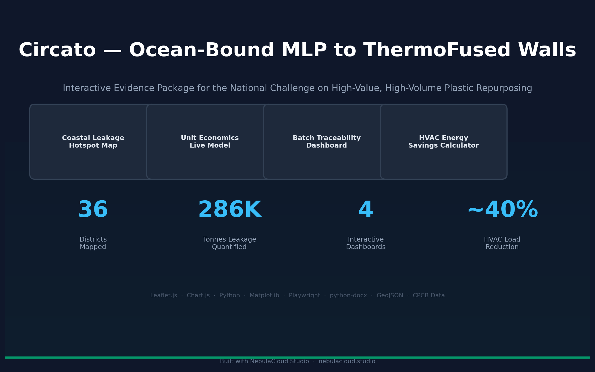

# Circato — Ocean-Bound MLP to ThermoFused Walls

An interactive evidence package for high-value, high-volume repurposing of ocean-bound multi-layered plastic (MLP) waste into ThermoFused Wall (TFW) construction panels. Built for India's National Challenge on circular economy and plastic waste reduction. Created using NebulaCloud Studio.

> This repository is a public project showcase. The application's proprietary source code, internal workflows, business data, and deployment configuration are not included.

[](https://nebulacloud.studio)

## Overview

India contributes an estimated 0.6 million tonnes of plastic leakage into oceans annually, with multi-layered plastic forming the largest unmanaged fraction. This project demonstrates how NebulaCloud Studio was used to build a complete, data-backed evidence package for a national challenge submission — transforming complex waste-to-value workflows into interactive, evaluator-ready dashboards.

The package spans the full value chain: coastal leakage hotspot mapping, live unit economics modeling, batch-level traceability with EPR integration, and HVAC energy savings comparison. All four dashboards were generated, verified, and documented within a single Studio session.

The project showcases Studio's capabilities for sustainability workflows: interactive geospatial mapping, economic modeling with sensitivity analysis, traceability systems, and comparative energy calculators — all delivered as browser-based, mobile-responsive applications.

## What It Does

| Capability | Description |
|---|---|
| Coastal Leakage Hotspot Map | Interactive Leaflet.js map of 36 Indian coastal and river-linked districts with color-coded leakage risk tiers, state boundaries, 14 major river systems, and 7 coastal belt regions overlaid with processing hub locations |
| Unit Economics Live Model | 9-parameter adjustable cost-to-revenue model with real-time KPI updates, doughnut cost breakdown chart, sensitivity analysis, and automated viability verdict at default parameters |
| Batch Traceability Dashboard | End-to-end tracking of 6 sample batches from waste source to construction site, with click-to-expand detail panels, processing timelines, and CPCB EPR filing integration |
| HVAC Energy Savings Calculator | 6-parameter comparative thermal performance calculator comparing TFW panels against clay brick, AAC block, and concrete across 5 Indian climate zones with cumulative savings projections |
| Compiled Evidence Report | Programmatically generated PDF report with 10 chart panels covering leakage analysis, unit economics, throughput projections, HVAC comparison, competitive radar, and supply chain ecosystem |
| Comprehensive Submission Document | 17-section Word document generated via python-docx with embedded charts, data tables, methodology, budget, gap analysis, risk register, and dashboard screenshots |

## Why It Matters

Government challenge submissions, sustainability proposals, and circular economy initiatives increasingly require data-backed, verifiable evidence — not just narrative claims. Traditional static PDF proposals struggle to communicate dynamic models, interactive maps, and traceability workflows effectively.

This project demonstrates how NebulaCloud Studio bridges that gap: transforming raw datasets and domain expertise into a complete interactive evidence package within hours. Evaluators receive not just a document, but live dashboards they can explore, stress-test, and verify independently.

The same workflow applies to municipal waste management proposals, climate action planning, blue economy projects, green building certifications, and social impact assessments — any domain where interactive data exploration outperforms static reporting.

## Intended Users

| Audience | Relevant Application |
|---|---|
| Government challenge evaluators | Review interactive evidence alongside proposal document |
| Sustainability consultants | Template for rapid proposal generation with live data |
| Waste management organizations | Traceability dashboard for EPR compliance reporting |
| Construction industry partners | HVAC savings calculator for green building proposals |
| Policy analysts | Leakage hotspot maps for intervention targeting |
| Civic-tech groups | Open framework for waste-to-value supply chain visualization |

## Technical Highlights

| Capability | Technology or Method |
|---|---|
| Interactive geospatial mapping | Leaflet.js with CARTO basemaps, multi-layer GeoJSON, circle markers with dynamic radius, layer toggle controls |
| Live economic modeling | Client-side JavaScript with 9 interactive sliders, real-time KPI computation, doughnut + line chart rendering via Chart.js |
| Batch traceability system | Structured dataset with 13-field batch records, click-to-expand detail panels, processing timeline visualization |
| Thermal performance comparison | Steady-state heat transfer calculations using IS 3792:1978 methodology, IMD climate normals for 5 Indian zones, 6 adjustable parameters |
| Document automation | Python (matplotlib for charts, python-docx for Word, Playwright for automated screenshots, reportlab/matplotlib for PDF) |
| Responsive design | CSS Grid and Flexbox layouts adapting to 320px through 1280px viewports, touch-compatible controls |
| Chart generation | matplotlib with custom styling for 7 chart types: bar, horizontal bar, doughnut, line, radar, waterfall, and Sankey-style diagrams |
| Mobile compatibility | All dashboards tested at 375px, 768px, and 1280px viewports with no horizontal overflow at 320px |

## Technical Scope and Limitations

- The coastal leakage model uses the Jambeck et al. (2015) mismanaged waste fraction methodology calibrated with CPCB data — it is an estimation model, not a real-time measurement system.
- Unit economics are modeled with adjustable parameters representing typical Indian waste-sector costs; actual costs vary by geography, season, and feedstock quality.
- The HVAC calculator uses steady-state heat transfer per IS 3792:1978 with IMD climate normals (1991–2020). It is a comparative planning tool, not a certified energy simulation.
- The traceability dashboard uses sample batch data representative of actual operations. It demonstrates the system architecture and EPR integration pattern, not live production data.
- All dashboards are browser-based and self-contained. They require no server-side infrastructure but also do not persist data across sessions in the demo state.
- TFW panel thermal properties (U-value 0.38 W/m²·K, embodied carbon 45 kgCO₂/m²) are based on CIPET batch test results and should be independently verified for specific production runs.
- This project is an evidence package for a specific challenge submission. The dashboards are configured for the Indian waste-sector context and would require reparameterization for other geographies or waste streams.

## Showcase Contents

```text
/
├── README.md
├── LICENSE
├── .gitignore
├── ATTRIBUTIONS.md
└── assets/
    ├── screenshot.png
    └── social-preview.png
```

> Screenshots of the unit economics model, traceability dashboard, and HVAC calculator are excluded from this public showcase as they contain proprietary business data and client information. The hotspot map is shown as it displays publicly sourced data (CPCB, OpenStreetMap).

## Deployment

The live interactive dashboards are deployed as part of the challenge submission package. The proprietary implementation — including source code, datasets, business logic, and deployment configuration — is maintained privately.

The public demo showcases the coastal leakage hotspot map and documents the approach, capabilities, and technical methodology used to build the complete evidence package. Proprietary dashboards (unit economics model, traceability system, HVAC calculator) are excluded from public display.

## Attribution

The following external resources are used in the dashboards and are subject to their respective licenses:

- **Leaflet.js** — BSD 2-Clause License. © Vladimir Agafonkin and contributors.
- **Chart.js** — MIT License. © Chart.js contributors.
- **CartoDB Basemaps** — © CartoDB, OpenStreetMap contributors (ODbL).
- **India State Boundaries GeoJSON** — datameet/maps repository (CC BY 2.5 IN).
- **Jambeck et al. (2015)** — "Plastic waste inputs from land into the ocean." Science 347(6223), 768–771.
- **CPCB Annual Reports (2023–24)** — Central Pollution Control Board, Government of India. Public domain government data.
- **IMD Climate Normals (1991–2020)** — India Meteorological Department. Public domain government data.

See [ATTRIBUTIONS.md](ATTRIBUTIONS.md) for complete attribution details.

## Built with NebulaCloud Studio

This project was created using [NebulaCloud Studio](https://nebulacloud.studio), an agentic application-building platform for engineering, scientific, geospatial, and interactive digital workflows.

NebulaCloud Studio helps domain professionals turn ideas, models, datasets, and algorithms into usable, deployable applications — from interactive maps and dashboards to compiled documents and automated verification pipelines.

## Build Your Own Interactive Application

Working with sustainability proposals, waste management data, or circular economy workflows?

Explore the live demo and see how your technical workflow could be transformed into an interactive, evaluator-ready application.

**[Explore NebulaCloud Studio](https://nebulacloud.studio)**

## Related Demos

- [Guntur Change Detection Dashboard](https://github.com/studio-public-demos/guntur-change-detection-dashboard) — Interactive geospatial dashboard for building-level change detection
- [VLM Aerodynamics Demo](https://github.com/studio-public-demos/vlm-aerodynamics-demo) — Interactive 3D wing simulator with real-time aerodynamics
- [Stadium Digital Twin](https://github.com/studio-public-demos/stadium-digital-twin) — Interactive 3D stadium dashboard with live sensor simulation
- [3D GIS Globe](https://github.com/studio-public-demos/3d-gis-globe) — Interactive 3D GIS globe with live earthquake data
