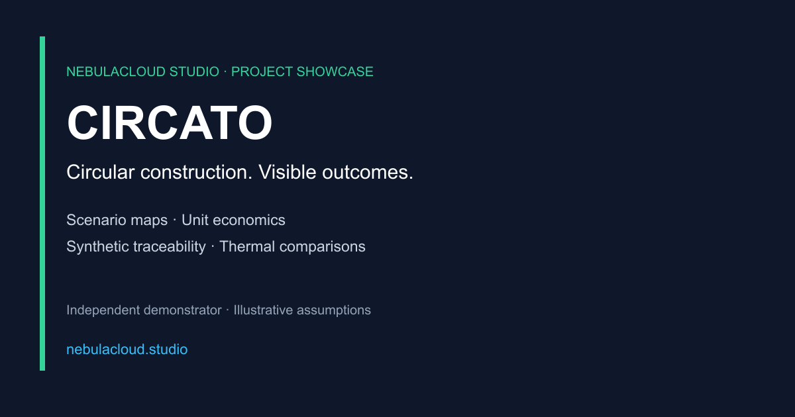
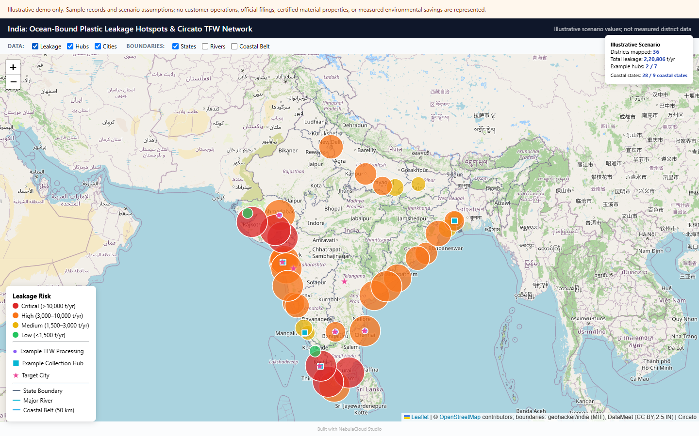
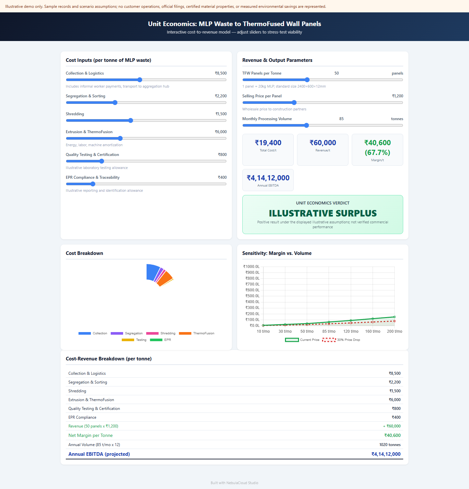
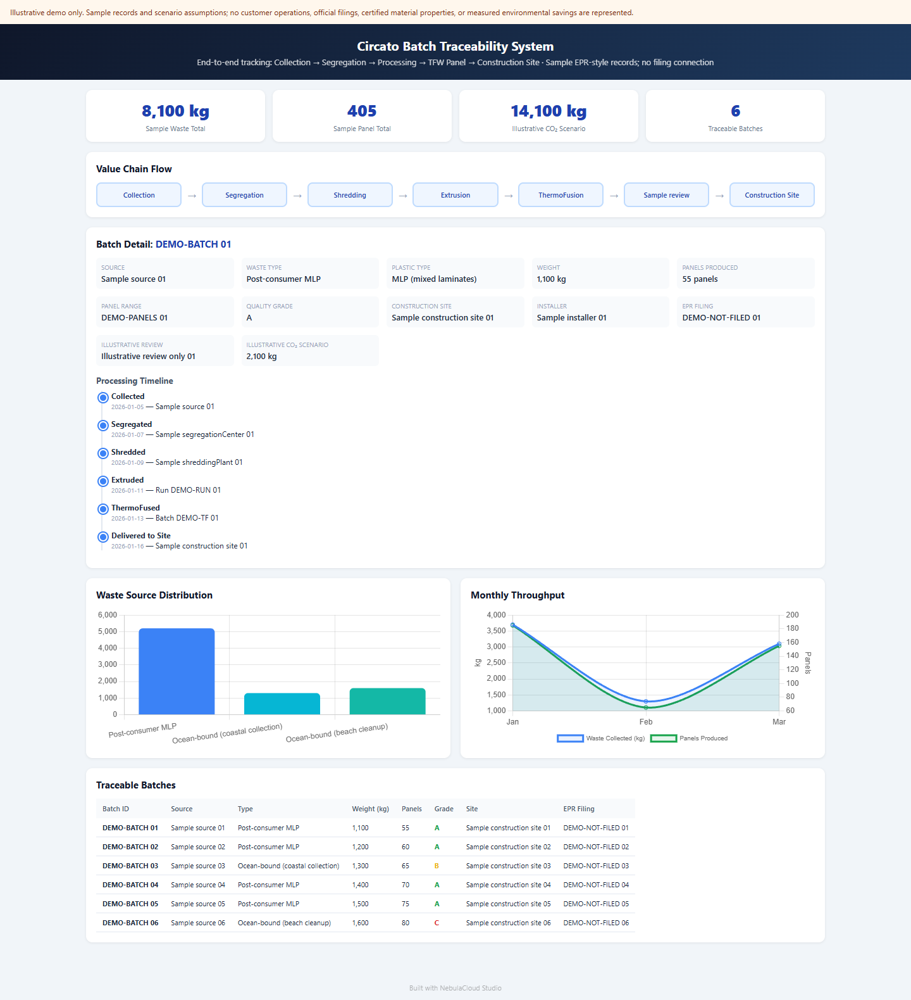
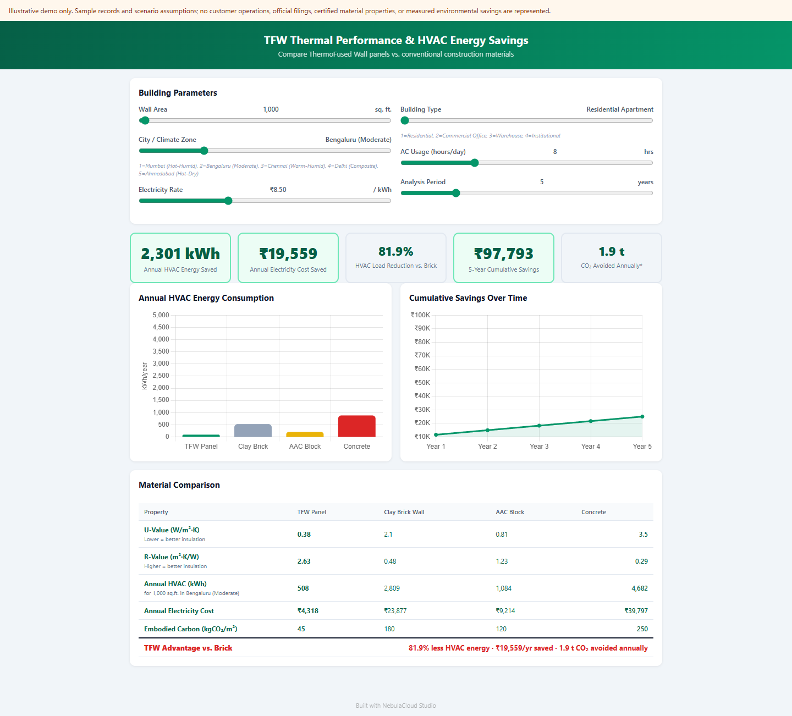
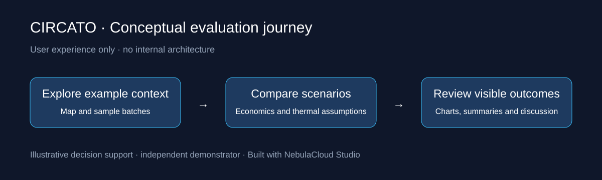

# CIRCATO — Ocean-Bound Plastic to ThermoFused Walls

> **Notice**
> This repository is a public project showcase created using NebulaCloud Studio.
> The proprietary source code, implementation details, prompts, workflows, datasets, infrastructure, and deployment configuration are intentionally excluded from the intended showcase scope.
>
> **Current IP compliance exception:** the public `docs/` directory still hosts the interactive demonstration's browser code and scenario data. It must move to separately managed hosting before this repository can be described as showcase-only. Earlier Git history also contains implementation files. Keeping the existing demo available does not resolve that exposure.

Independent technology demonstrator. No official CIRCATO application, endorsement, partnership, customer deployment, laboratory certification, or government integration is represented. All rights reserved; see [LICENSE](LICENSE).

## Overview

Explore how a circular-construction proposal can be presented through an interactive map, economic scenarios, synthetic batch records, and comparative thermal assumptions. This independent demonstration was created using NebulaCloud Studio.

## Business Problem

Circular-economy proposals need to communicate where interventions could occur, how cost assumptions affect viability, how materials could be tracked, and which building-performance questions need further investigation. Static narrative alone makes those assumptions difficult to explore.

## Solution Overview

Four browser experiences make the proposal tangible: inspect a district scenario map, adjust cost and revenue assumptions, review synthetic material batches, and compare illustrative thermal scenarios. They support discussion and evaluation; their outputs do not establish commercial or environmental performance.

## Live Demo

**[Launch the existing live demo](https://studio-public-demos.github.io/circato-ocean-plastic-tfw-dashboard/)**

- [Coastal scenario map](https://studio-public-demos.github.io/circato-ocean-plastic-tfw-dashboard/index-map.html)
- [Unit economics](https://studio-public-demos.github.io/circato-ocean-plastic-tfw-dashboard/economics.html)
- [Synthetic batch traceability](https://studio-public-demos.github.io/circato-ocean-plastic-tfw-dashboard/traceability.html)
- [Illustrative HVAC comparison](https://studio-public-demos.github.io/circato-ocean-plastic-tfw-dashboard/hvac.html)

The demonstration has no administrative interface or official filing connection. Do not enter private information. Its public browser implementation remains an IP policy exception pending hosting separation.

## Demo Video

[Watch the visual walkthrough](assets/videos/circato-walkthrough.mp4). This captioned, silent overview shows sanitized dashboard captures without source code or developer tools.

## Project Screenshots

Map imagery © OpenStreetMap contributors; community boundaries credited in [ATTRIBUTIONS.md](ATTRIBUTIONS.md).

## Generated Outputs

Representative displayed results, captured from the sanitized demo at its default settings:

- [Unit economics result](assets/outputs/economics-sample.png)
- [Synthetic batch detail and summaries](assets/outputs/traceability-sample.png)
- [Thermal comparison result](assets/outputs/hvac-sample.png)

These are output images, not reusable models or underlying datasets. No original submission PDF, Word report, or laboratory report is available for independent verification; none is represented as a delivered artifact here.

## Key Features

| Experience | What visitors can explore |
|---|---|
| Map | Example district markers, risk colours, layer switches and community state boundaries |
| Economics | Adjustable assumptions and responsive cost, revenue and sensitivity displays |
| Traceability | Six synthetic batches, illustrative record fields and expandable processing detail |
| Thermal comparison | Adjustable scenarios, material comparisons and cumulative projections |

## Intended Users

Sustainability proposal teams, programme evaluators, circular-economy planners, construction stakeholders, and organisations evaluating a similar interactive presentation.

## Example Use Cases

- Discuss potential collection and processing locations using an illustrative map.
- Explore how changing cost assumptions affects a proposal's economic scenario.
- Demonstrate a possible material-tracking user experience with synthetic records.
- Identify thermal-performance assumptions that require independent testing.

## Technical Highlights (High-Level Only)

Browser-based interactive mapping, adjustable scenario models, chart-based summaries, expandable sample records, and responsive presentation. External map and chart resources are identified in the attribution document. No internal APIs, platform internals, service topology, schemas, prompts or orchestration are described.

## Architecture Overview (Conceptual Only)

Visitors explore example context, compare scenarios, and review visible outcomes. This user journey describes the experience rather than the implementation.

## Technical Scope & Limitations

- District values and batch records are synthetic examples regenerated for this public demo. Model assumptions are illustrative and have not been independently validated.
- Traceability records are synthetic, with generic sites, installers, and demonstration identifiers. They are not customer records, certificates, or submitted EPR filings.
- No official CPCB integration, certified TFW properties, BIS compliance, measured emissions reduction, commercial viability or realised energy saving is claimed.
- The thermal comparison is a simplified planning illustration, not a certified building-energy simulation. Material and climate inputs require independent validation.
- External basemap tiles, boundaries and chart libraries require network access; availability and upstream changes may affect the experience.
- This demonstration does not provide production persistence, authentication, customer administration, or regulated compliance services.
- Removing files from the current branch would not remove previous public history, clones, caches or historical licence grants. Full IP remediation requires a hosting migration and a separate historical-exposure review.

## Performance Summary (Verified Only)

Validation performed on 9 October 2026 checks the five demo pages at 320, 375, 768 and 1440 pixel viewport widths and exercises map toggles, model inputs and batch expansion. The accompanying compliance report records actual results and any failures. No throughput, build-time, scientific accuracy, production reliability, or financial performance benchmark is asserted.

## Attribution

See [ATTRIBUTIONS.md](ATTRIBUTIONS.md) for map imagery, boundary sources, third-party libraries and provenance limitations. The [showcase licence](LICENSE) covers original presentation materials only; third-party rights and trademarks remain with their owners.

## Built with NebulaCloud Studio

Created using [NebulaCloud Studio](https://nebulacloud.studio). Explore the [central showcase catalogue](https://studio-public-demos.github.io/) and [project collection](https://github.com/studio-public-demos) for further examples.

## Related Project Showcases

- [Guntur Change Detection Dashboard](https://github.com/studio-public-demos/guntur-change-detection-dashboard)
- [VLM Aerodynamics Demo](https://github.com/studio-public-demos/vlm-aerodynamics-demo)
- [Stadium Digital Twin](https://github.com/studio-public-demos/stadium-digital-twin)

## Call to Action

[Explore the live demo](https://studio-public-demos.github.io/circato-ocean-plastic-tfw-dashboard/) or [visit NebulaCloud Studio](https://nebulacloud.studio) to discuss a similar solution. For evaluation and licensing enquiries, [contact NebulaCloud Studio](mailto:contact@nebulacloud.studio).
